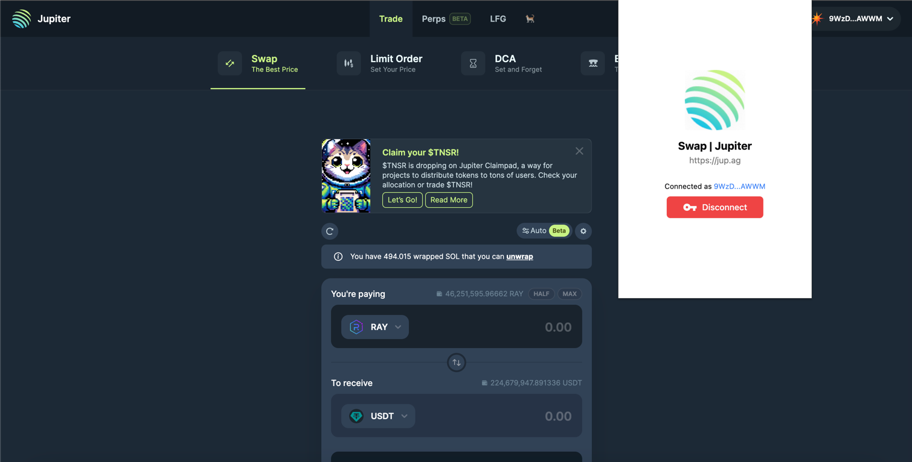
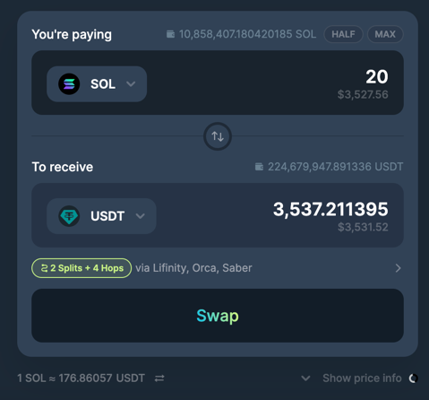
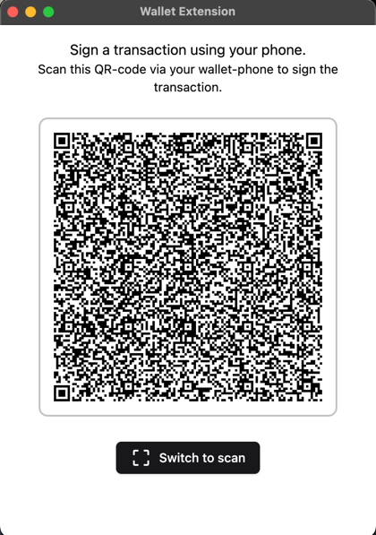
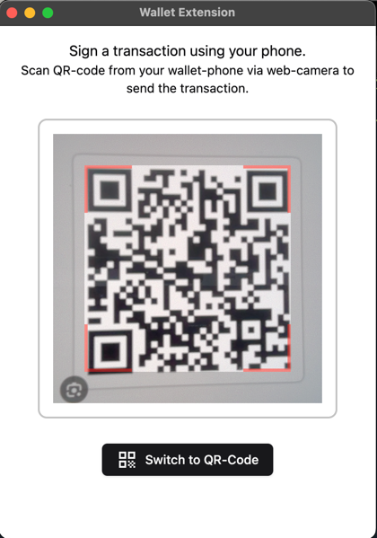
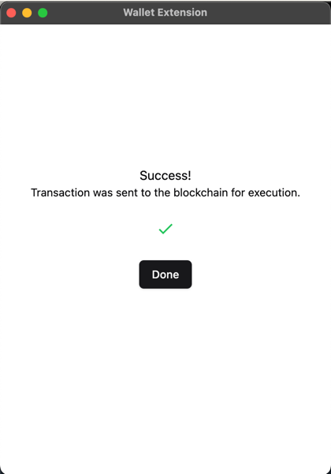

# Magni Extension

Secure Solana wallet extension for communicating with Magni App and generating QR-Codes

## Instalation

To install and run the application follow these steps:
- Clone the repository using `git clone https://github.com/magnisolana/magni-extension.git`
- Open the folder with files using `cd magni-extension`
- Install required packages from NPM using `npm install`
- Build application using `npm run build`
- Open the browser and write `chrome://extensions` in the URL
- Turn on the "Developer mode" checkbox in the right-top corner of the page
- Press "Load unpacked" button and select `/dist` folder from the directory with extension files
- After that, the extension "Magni" will be added to your extension list. Enable this extension and then you can start using it as intended

## Usage

- Open any Solana swap, for example https://jup.ag/
- Press on the icon of the extension in the right-top corner and enter your Solana address, to connect to the dApp

- After that you can start creating transactions. For example let's try to swap 20 SOL to USDT

- After pressing the swap button, window with the QR-Code will appear. Scan this QR via Magni App on your wallet-phone (the phone which you turned into a hardware-wallet) and sign the transaction.

- After signing transaction, the QR code will appear on your phone screen. Press "Switch to scan" button in your extension and scan this QR via your computer camera

- After scanning the final QR code the transaction will be published to blockchain and your coins will be successfully swapped

